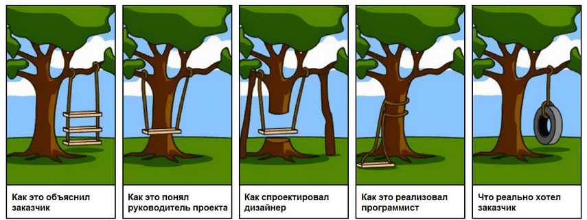

Часто у вас бывает такое, что проект сдан, но заказчик получил совсем не то на что расчитывал.

### Дайте больше информации

В общении с клиентом зачастую бывает недопонимание "хотел одно получил другое".
У меня было так , клиент просит сделать простой сайт, на словах расказывает как и что должно быть, что-то рисует показывает.
но он не учел деталей 

### Чем точнее требования, тем лучше программист сделает свою работу.

Например проект "Разработка сайта". Клиент обычно на словах описывает "То что хочет видеть" баннеры, кнопки, дизайн. После этого разработчик должен оценить проект, расписать задачи, построить структуру проекта.
Надеюсь понятно что , то насколько точно и полно клиент опишет проект, исходя их этого разработчик построит у себя картину в голове "Как сделать эту фичу. С чего начать"
К чем это все. Расписывайте требования как можно точнее, напишите вордовский фаил хотя бы, еще лучше сделайте скрины с других сайтов как пример.
Дайте разработчику то с чем работать, что угодно фото,текст, не знаю там рассакажите по скайпу)

Итог: Распишите более полно свое виденье проекта со всеми деталями и нюансами, держите диалог с программистом, только в этом случае можно сделать более точную оценку.

### Сложно оценить то, что никогда не делал

В требованиях к проекту неизвесный вам фреймворк или технология, в этом случаее разработчик не сможет оценить время выполнения задач.
Также, у всех программистов разный уровень, отсюда и оценки разные.

### Что же делать и как правильно оценить задачу

Фиксируйте свое время на выполнение задач, для это куча сервисов например [https://toggl.com/ ](https://toggl.com/ ) .

Конечно же уточняйте требования, убедитесь что все моменты учтены, оцените масштаб работы. Если сложно дать точную цифру давайте интервал например один-два дня. Разбейте задачи на подзадачи.
Заложите неочевидные моменты, новая технология, внешнее api.

6. Обсудить написанное задание с непосредственным исполнителем, попытаться разрешить все вопросы, внимательно прислушиваясь к мнению собеседника. Не стоит забывать, что вы свою сферу деятельности знаете лучше и только вы можете точно объяснить, какой инструмент вам необходим для эффективно работы. IT-специалист знает свое дело и не обязан знать нюансы работы каждого отдела в организации.

заложить непредвиденные обстоятельства

не оправданы ожидания