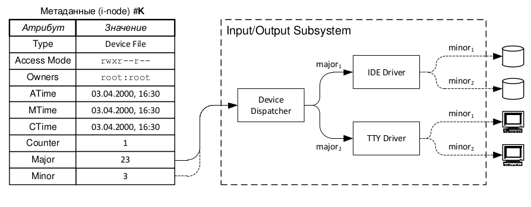
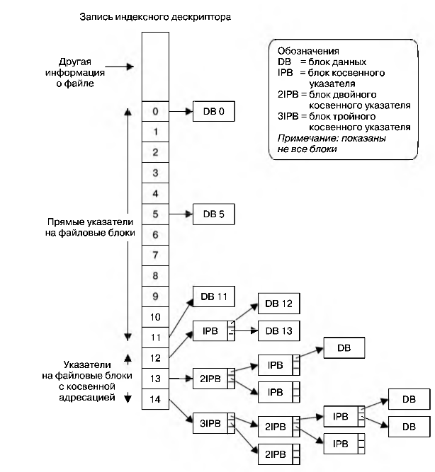

### Специальный фаил устройства

Как ни странно, но сами диски в linux представлены в виде файлов. Это отдельный тип файлов в linux.

Специальный фаил устройства соответсвует устройству в системе. 
Каждому типу устройства соответствует драйвер устройства, который обрабатывает запросы на ввод-вывод устройства.

Устройства могут быть реальными (мышь, диск, CD-ROM) и виртуальными (Ядро представляет абстрактное устройство с API таким же как у реального).

Типы устройств :

1. Символьные - обрабатывают данные посимвольно (терминал, клавиатура, мышь)
2. Блочные - обрабатывают данные поблочно, размер блока обычно кратен 512 байтам (диск)

Файлы устройств располагаются в каталоге `dev` подобно другим файлам. 

Ранее каталог `dev` содержал записи для всех возможных устройств в системе, даже если физически их не было. Проблему
решили с помощью `udev`, которая опирается на файловую систему `sysfs`, экспортирующую информацию об устройствах в 
пространство пользователя через файловую систему смотрированную в каталог `sys`.

Каждый фаил устройтва имеет идентификаторы :

1. Старший идентификатор - общий класс устройства, используется для поиска драйвера.
2. Младший идентификатор - номер уникально идентифицирующий устройство внутри класса.

Идентификаторы записаны в индексном дискрипторе для данного устройства.



Ядро linux понимает жесткие диски в следующем формате :

1. hdX [a-z] - IDE диски
2. sdX [a-z] - SCSI диски
3. vdX [a-z] - Виртуальные жесткие диски
4. srN или scdN [0..] - CD-ROM

Новый диск необходимо разметить, то есть создать новую таблицу разделов. Они бывают двух типов :
1. MBR (MSDOS или DOS) - Master Boot Record
2. GPT (UEFI) - GUID Partition Table

Таблица рзделов (Partition Table) содержит информацию о первичных разделах и расширенных разделах.

Например :
sda
primary sda1
primary sda2
primary sda3
primary sda5
primary sda6
primary sda7
primary sda8 

Таблица разделов MBR  4 физических, 16 логических раздела - 2ТБ
Таблица разделов GPT до 128 разделов 9.4 x 10^21 байт
Выравниваение раздела относительно сектора

Каждый диск может быть поделен на один или несколько самодостаточных логических дисков называемыми разделами.
Каждый раздел воспринимается ядром как отдельное устройство.

```bash
ls -l /dev/sd*
brw-rw---- 1 root disk 8,  0 апр  4 17:16 /dev/sda
brw-rw---- 1 root disk 8,  1 апр  4 17:16 /dev/sda1
brw-rw---- 1 root disk 8, 16 апр  4 17:16 /dev/sdb
brw-rw---- 1 root disk 8, 17 апр  4 17:16 /dev/sdb1
brw-rw---- 1 root disk 8, 32 апр  4 17:16 /dev/sdc
```
Проверим его тип.

```bash
file /dev/sda
/dev/sda: block special (8/0)
```

Например можно получить прямой доступ в данным на диске.

```bash
sudo hexdump -C /dev/sda | less
0000000 0000 0000 0000 0000 0000 0000 0000 0000
*
00001c0 0002 ffee ffff 0001 0000 ffff 007f 0000
00001d0 0000 0000 0000 0000 0000 0000 0000 0000
*
.....
```

Список разделов диска можно узнать командой, к примеру для sda `sudo fdisk /dev/sda -l`

```bash
sudo fdisk /dev/sda -l
Disk /dev/sda: 4 GiB, 4294967296 bytes, 8388608 sectors
Disk model: VMware Virtual I
Units: sectors of 1 * 512 = 512 bytes
Sector size (logical/physical): 512 bytes / 512 bytes
I/O size (minimum/optimal): 512 bytes / 512 bytes
Disklabel type: gpt
Disk identifier: 5D59BB9F-1511-C04B-985B-1863D793A358

Device     Start     End Sectors Size Type
/dev/sda1   2048 8388574 8386527   4G Linux filesystem
```
Накопитель может и не содержать таблицу разделов. Цилиндр - это совокупность секторов

Теперь посмотрим старшие(major) и младшие номера устройства(minor)

```bash
cat /proc/partitions 
major minor  #blocks  name

   8        0    4194304 sda
   8        1    4193263 sda1
   8       16   10485760 sdb
   8       17   10484736 sdb1
   8       32    5242880 sdc
  11        0    1048575 sr0
```
Размеченный раздел диска может содержать любую информацию, но обычно содержит : 

1. Файловую систему
2. Область данных
3. Область подкачки

### Файловая система

Наиболее расспространенный тип информации на разделе жесткого диска это упорядоченный набор файлов и каталогов что называется файловой системой.

Linux поддерживает множество файловых систем. 
Например текущим ядром поддерживаются следующие фс :

```bash
cat /proc/filesystems
nodev   sysfs
nodev   rootfs
nodev   ramfs
nodev   bdev
nodev   proc
nodev   cpuset
nodev   cgroup
nodev   cgroup2
nodev   tmpfs
nodev   devtmpfs
nodev   configfs
nodev   debugfs
nodev   tracefs
nodev   securityfs
nodev   sockfs
nodev   dax
nodev   bpf
nodev   pipefs
nodev   hugetlbfs
nodev   devpts
        ext3
        ext2
        ext4
        squashfs
        vfat
nodev   ecryptfs
        fuseblk
nodev   fuse
nodev   fusectl
nodev   pstore
nodev   mqueue
nodev   autofs
nodev   overlay
nodev   aufs
        xfs
        jfs
        msdos
        ntfs
        minix
        hfs
        hfsplus
        qnx4
        ufs
        btrfs
```
Основной единицей выделения пространства на диске является логический блок (множество смежных физических блоков на устройстве)

Размер логического блока 
```bash
sudo tune2fs -l /dev/sdb1 | grep "Block size"
Block size:               4096
```
Файловая система состоит из следующих частей :

1. Блок начальной загрузки. Первый блок файловой системы. Содержит информацию для загрузки файловой системы.
2. Суперблок. Содержит информацию о параметрах файловой системы такие как 
    1. Размер таблицы индексных дескрипторов
    2. Размер логических блоков
    3. Размер файловой системы в  логических блоках
3. Таблица индексных дескрипторов (Индексный список). 
   Каждый фаил в данной файловой системе обладает уникальной записью в таблице индексных дескрипторов
   Записи содержат информацию о файле. Индексные дескрипторы в таблице идентифицируеются с помощью номеров.
   Вывести номер индексного дескриптора файла или индексный номер может команда `ls -li` номер обозначается первым числом
   ```bash
   ls -li _drafts/linux-filetype.md 
   6687385 -rw-rw-r-- 1 alex alex 8774 апр  5 10:43 _drafts/linux-filetype.md
   ```
4. Блоки данных - пространство файловой системы, где хранятся данные.

### Таблица индексных дескрипторов

1. Тип файла
2. Владелец (UID)
3. Группа (GID)
4. Права доступа на фаил (владелец, группа, остальные)
5. Метки времени (время последнего доступа к файилу `ls -lu`, время последнего изменения `ls -l`, время последнего измененения статуса файла(информации индексного дескриптора) `ls -lc`).
    >> Время создания файла не записывается

6. Кол-во жестких ссылок на фаил
7. Размер файла в байтах
8. Кол-во блоков отведенных для данного файла
9. указатели на блоки данных файла

В качестве примера возмем файловую систему `ext2`, где каждый индексный дескриптор содержит 15 указателей.
Первые 12 пронумерованы и указывают на положение 12 блоков файла. 13 указатель содержит указатель на блок указателей, который сообщает расположение
последующих блоков.
Для каждого блока нужно 4 байта и поеэтому если блок равен 4096 байт то максимальное кол-во указателей может быть 1024.
Для файлов большего размера могут двойные и тройные косвенные указатели являющиеся ссылкой на блоки указателей.



Теоритически такая схема хранения допускает наличие файлов больших размером при размере блока 4096 байт следовательно
фаил может весить до 4 ТБ

https://linux-notes.org/kak-ispol-zovat-komandu-fdisk-na-linux/
https://fsen.ru/linux/gpt-mbr
http://rus-linux.net/MyLDP/hard/manage_disk_partitions_with_fdisk.html
http://yournet.kz/blog/os/linux/9-komand-dlya-prosmotra-informacii-o-razdelax-i-diskax

http://itisgood.ru/2019/06/06/kak-sozdat-novuju-fajlovuju-sistemu-ext4-razdel-v-linux/
В Linux все друг с другом связано, невозможно все последовательно расмотреть

### Тип фаил (Regular file)

Мы плавно подошли к основополагающему понятию файловой системы в linux - это фаил.
Фаил это именованная область данных на внешнем носителе. Фаил содержит может содержать любую
пользовательскую информацию в виде набора байт при этом операционная система не накладывает
никаких ограничений.
Как мы выяснили выше метаданные (атрибуты) файла хранятся в индексном дескрипторе.

### Тип директория

### Тип символьная ссылка

### Тип именованный канал