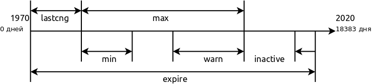

[Часть 1 - Linux. Хранение информации](https://lexusalex.ru/linux-Information-storage)

Основная абстракция linux - все есть файл, что позволяет использовать один интерфейс для работы с
любыми объектами системы через файлы. Любой объект в linux имеет своего владельца, то есть пользователя.

Классический механизм разграничения прав доступа в linux представляет из себя объекты, то есть файлы доступ к которым разграничивается и
субъекты, то есть пользователи доступ которых разграничивается.

О субъектах сейчас и пойдет речь.

Каждый пользователь характеризуется следующими обязательными параметрами :
1. Уникальное имя пользователя
2. UID - уникальный идентификатор пользователя
3. GID - уникальный идентификатор группы пользователя

и некоторыми необязательными, но о них позже.

### Пользователи

Пользователи могут хранится в двух хранилищах :
1. Локальное (автономное) ("Из коробки" в файлах)
2. Сетевое (NIS, LDAP)

Пользователи могут быть двух типов :
1. Системные ("псеводо") пользователи.
2. Реальные пользователи.

Исторически сложилось что локально пользователи в системе хранятся в двух таблицах (файлах), где каждый пользователь представлен одной строкой.

#### /etc/passwd

`/etc/passwd` - это системный файл паролей, где записаны его параметры в 7 полях разделенных символом ` : ` в следующем порядке :

Файл доступен для чтения всем.

1. name

    Имя пользователя для входа в систему.
    
    Символьное имя пользователя которое соответствует его числовуому идентификатору.
    
    - регулярное выражение которое соответсвует символам которые могут быть в имени пользователя `[a-z_][a-z0-9_-]*[$]?`
    - имена пользователей могут быть длиной не более 32 символов.
    
    *В старых версиях unix существовало ограничение на длину логина в 8 символов*
2. passwd 

    Зашифрованный пароль пользователя.
    
    По историческим причинам вся информация о пользователе включая зашифрованный пароль хранится в открытом файле для чтения `/etc/passwd`.
    В связи в этим вознили проблемы безопасности. В противостояние этому был разработан файл [теневой файл паролей](/etc/shadow) `/etc/shadow` в котором хранится вся конфидициальная информация пользователя.
    
    В современных версиях linux при включенном режиме "теневых паролей" это поле игнорируется и содержит символ `x`, хотя может содержать
    любую символьную строку, а зашифрованный пароль хранится в файле теневых паролей.
    
    У пользователя пароля может не быть.
3. UID

    Числовой идентификатор пользователя. 
    
    Система руководствуется в первую очередь имеено идентификатором, а не именем пользователя.
    
    Их диапазон может быть разным в зависимости от типа пользователя и операционной системы.
    
    Для многих системных служб номера идентификаторов зарезервированы.
    
    Существуют два специальных правила присвоения идентификаторов:
    - 0 для root
    - 65534 для nobody
    
    *Пользователь nobody не может являтся владельцем не одного файла в системе*
    
    В остальном система не накладывает на присвоение никаких ограничений.
    
    *В системе может быть несколько пользователей с одним UID, но использовать такую возможность не рекомендуется*
4. GID

    Для более гибкого разграничения прав доступа существуют группы.
    
    GID - это числовой идентификатор первой из групп в которую входит пользователь.
    Дальнейшая принадлежность пользователя к группам определена в системном файле групп `/etc/group/`
    
5. GECOS
    
    Необязательный комментарий для ученой записи. Определенного формата в современных системах нет, но могут быть заполнены следующие опции
    - Полное имя пользователя
    - адрес офиса или домашний адрес 
    - рабочий телефон 
    - домашний телефон
    
6. dir

    Домашний каталог пользователя
    
7. shell

    Оболочка пользователя для входа в систему. 
    Существуют особые "оболочки" которые запрещают пользоателю заходить в систему :
    
    - `/usr/sbin/nologin` - выдает сообщение "This account is currently not available."
    - `/bin/false` - просто запрещает вход в систему
    
Примеры : 
- `root:x:0:0:root:/root:/bin/bash` 
- `speech-dispatcher:x:120:29:Speech Dispatcher,,,:/var/run/speech-dispatcher:/bin/false`

##### Диапазон UID и GID

Диапазон UID и GID указывается в конфигурационном файле `/etc/login.defs`

Условно идентификаторы UID и GID делят на группы для обычных и системных пользователей.

Диапазон UID и GID значений по умолчанию для обычных пользователей которые используют программы `useradd` , `groupadd` , `newusers` :

- UID_MIN = 1000
- UID_MAX = 60000
- GID_MIN = 1000
- GID_MAX = 60000

Диапазон UID и GID значений по умолчанию для системных пользователей и служб используемых в программах `useradd` и `newusers`:

- SYS_UID_MIN = 101
- SYS_UID_MAX = UID_MIN - 1
- SYS_GID_MIN = 101
- SYS_GID_MAX = GID_MIN - 1

Максимальное значение идентификатора : 65534

##### root

Сложились ряд рекомендаций как работать с этим привелигерованным пользователем :

1. Не следует работать от имени этого пользователя ежедневно, работайте от не привелигерованного пользователя.
2. Для выполнения разовых администативных задач повышайте привелегии с помощью `sudo`
3. Сделать невозможным вход под учетной записью root в интерактивном режиме.

https://interface31.ru/tech_it/2019/12/linux-nachinayushhim-chast-6-upravlenie-pol-zovatelyami-i-gruppami.html

#### /etc/shadow

`/etc/shadow` - теневой файл паролей. Нужен для хранения пароля и некой другой закрытой информации пользователя.

Здесь параметры пользователя записаны в 9 полях разделенных символом ` : ` в следующем порядке : 

1. name
    Имя пользователя. Поле должно содержать правльное имя пользователя которое существует в файле `/etc/passwd`.
2. passwd
    Пароль пользователя в зашифрованном виде. 
    *Если поле содержит `!` или `*` это значит, что пользователь не может использовать это пароль, но может войти в
    систему под другими паролями*
    
    Возможны варианты что поле будет пустым.
    Поле пароля может начинаться в `!` это говорит о том что пароль заблокирован. Последующие символы и будут представлять пароль пользователя
3. latching
    Дата последней смены пароля в днях начиная с 1 января 1970 года.
    
    - Значение 0 имеет специальное значение, говорит о том что пользоатель должен сменить пароль при следующем входе в систему.
    - Пустое значение обозначает, что проверка устаревания пароля выключена.
4. min
    Минимальный срок действия пароля в днях, через указанное количество которых пользователи
    должны сменить пароль.
    
    - Значение 0 или пустое отключают минимальный срок действия пароля
5. max
    Максимальный срок действия пароля, по просшедствии которого пользователь должен сменить пароль.
    
    - Пустое значение обозначает что у пароля нет максимального срока действия, нет периода предупреждения и
      нет периаода неактивности пароля.
6. warn
    Количество дней до устаревания пароля во время которых пользователю выдаётся предупреждение.
    
    Пустое значение поля и 0 отключают период предупреждения о пароле.
    
7. inactive
    Количество дней после устаревания пароля  во время которых пароль всё ещё принимается 
    (и пользователь должен обновить свой пароль при следующем входе).
    
    После устаревания пароля и истечения этого периода устаревания вход с текущим 
    паролем становится невозможным.
    
    Пустое значение поля означает, что период неактивности отсутствует.
8. expire
    Дата истечения срока действия учётной записи. Поле не имеет никакого отношения в паролям

9. flag
    Это поле зарезервировано для использования в будущем.

Примеры : 
- `nvidia-persistenced:*:17614:0:99999:7:::`

Эти таблицы между собой взаимосвязаны их используют различные утилиты.

### Группы

Для более гибкого управления пользователями нужны группы. Пользователь может состоять в нескольких группах.

Список групп как и в случае с пользователями так же хранится в файлах.

*При создании пользователя в linux ему создается одноименная группа*

*Первоначально принадлежность к пользователя к группе было динамическим, нужно было предъявить пароль.
Потом членство в группах стало статическим и потребность в использоваонии пароля отпало.

Группы пользователей хранятся построчно в файле `/etc/group/` и `/etc/gshadow/` точно так же как и пользователи.

#### /etc/group/

Поля файла имеют следующий формат :

1. name group
2. passwd
    Когда у группы существовал пароль, но он точно так же перешел приватный файл `/etc/gshadow/`
3. GID
4. users group
    Список членов
    Если пользователь входит только в свою одноименную группу, в этом поле он не указывается.

#### /etc/gshadow/

Поля файла имеют следующий формат :

1. namegroup
2. passwd
3. users admin
    Администраторы группы, у которых особая роль, они могут изменять список членов группы
4. users group

Заблокировать учетную запись
passwd -l prizrak
passwd: информация об истечении срока действия пароля изменена.
Будет добавлен ! знак в хешу пароля

Разблокировать уч запись
passwd -u prizrak

### Утилиты для манипулирования учетными записями

~~~bash
dpkg -L passwd | grep /usr/sbin/ | sort
/usr/sbin/chgpasswd
/usr/sbin/chpasswd
/usr/sbin/cpgr
/usr/sbin/cppw
/usr/sbin/groupadd
/usr/sbin/groupdel
/usr/sbin/groupmod
/usr/sbin/grpck
/usr/sbin/grpconv
/usr/sbin/grpunconv
/usr/sbin/newusers
/usr/sbin/pwck
/usr/sbin/pwconv
/usr/sbin/pwunconv
/usr/sbin/useradd
/usr/sbin/userdel
/usr/sbin/usermod
/usr/sbin/vigr
/usr/sbin/vipw

dpkg -L passwd | grep /usr/bin/ | sort
/usr/bin/chage
/usr/bin/chfn
/usr/bin/chsh
/usr/bin/expiry
/usr/bin/gpasswd
/usr/bin/passwd
~~~

### Создание пользователя

Рекомендуется создавать пользоваетля командой `adduser`, нежели `useradd`

adduser
deluser
addgroup
delgroup
Обычный пользователь

centos

ссылка на одну команду 

ls -la /usr/sbin/useradd /usr/sbin/adduser
lrwxrwxrwx. 1 root root      7 ноя  9 02:05 /usr/sbin/adduser -> useradd
-rwxr-xr-x. 1 root root 241752 ноя  9 02:05 /usr/sbin/useradd

cat /etc/passwd
root:x:0:0:root:/root:/bin/bash
bin:x:1:1:bin:/bin:/sbin/nologin
daemon:x:2:2:daemon:/sbin:/sbin/nologin
adm:x:3:4:adm:/var/adm:/sbin/nologin
lp:x:4:7:lp:/var/spool/lpd:/sbin/nologin
sync:x:5:0:sync:/sbin:/bin/sync
shutdown:x:6:0:shutdown:/sbin:/sbin/shutdown
halt:x:7:0:halt:/sbin:/sbin/halt
mail:x:8:12:mail:/var/spool/mail:/sbin/nologin
operator:x:11:0:operator:/root:/sbin/nologin
games:x:12:100:games:/usr/games:/sbin/nologin
ftp:x:14:50:FTP User:/var/ftp:/sbin/nologin
nobody:x:65534:65534:Kernel Overflow User:/:/sbin/nologin
dbus:x:81:81:System message bus:/:/sbin/nologin
systemd-coredump:x:999:997:systemd Core Dumper:/:/sbin/nologin
systemd-resolve:x:193:193:systemd Resolver:/:/sbin/nologin
tss:x:59:59:Account used by the trousers package to sandbox the tcsd daemon:/dev/null:/sbin/nologin
polkitd:x:998:996:User for polkitd:/:/sbin/nologin
libstoragemgmt:x:997:994:daemon account for libstoragemgmt:/var/run/lsm:/sbin/nologin
cockpit-ws:x:996:993:User for cockpit-ws:/nonexisting:/sbin/nologin
sssd:x:995:991:User for sssd:/:/sbin/nologin
sshd:x:74:74:Privilege-separated SSH:/var/empty/sshd:/sbin/nologin
chrony:x:994:990::/var/lib/chrony:/sbin/nologin
alex:x:1000:1000:alex:/home/alex:/bin/bash

debian

cat /etc/passwd
root:x:0:0:root:/root:/bin/bash
daemon:x:1:1:daemon:/usr/sbin:/usr/sbin/nologin
bin:x:2:2:bin:/bin:/usr/sbin/nologin
sys:x:3:3:sys:/dev:/usr/sbin/nologin
sync:x:4:65534:sync:/bin:/bin/sync
games:x:5:60:games:/usr/games:/usr/sbin/nologin
man:x:6:12:man:/var/cache/man:/usr/sbin/nologin
lp:x:7:7:lp:/var/spool/lpd:/usr/sbin/nologin
mail:x:8:8:mail:/var/mail:/usr/sbin/nologin
news:x:9:9:news:/var/spool/news:/usr/sbin/nologin
uucp:x:10:10:uucp:/var/spool/uucp:/usr/sbin/nologin
proxy:x:13:13:proxy:/bin:/usr/sbin/nologin
www-data:x:33:33:www-data:/var/www:/usr/sbin/nologin
backup:x:34:34:backup:/var/backups:/usr/sbin/nologin
list:x:38:38:Mailing List Manager:/var/list:/usr/sbin/nologin
irc:x:39:39:ircd:/var/run/ircd:/usr/sbin/nologin
gnats:x:41:41:Gnats Bug-Reporting System (admin):/var/lib/gnats:/usr/sbin/nologin
nobody:x:65534:65534:nobody:/nonexistent:/usr/sbin/nologin
_apt:x:100:65534::/nonexistent:/usr/sbin/nologin
systemd-timesync:x:101:102:systemd Time Synchronization,,,:/run/systemd:/usr/sbin/nologin
systemd-network:x:102:103:systemd Network Management,,,:/run/systemd:/usr/sbin/nologin
systemd-resolve:x:103:104:systemd Resolver,,,:/run/systemd:/usr/sbin/nologin
messagebus:x:104:110::/nonexistent:/usr/sbin/nologin
sshd:x:105:65534::/run/sshd:/usr/sbin/nologin
alex:x:1000:1000:alex,,,:/home/alex:/bin/bash
systemd-coredump:x:999:999:systemd Core Dumper:/:/usr/sbin/nologin
test:x:1001:1001:,,,:/home/test:/bin/bash
Debian-exim:x:106:112::/var/spool/exim4:/usr/sbin/nologin

ubuntu

root:x:0:0:root:/root:/bin/bash
daemon:x:1:1:daemon:/usr/sbin:/usr/sbin/nologin
bin:x:2:2:bin:/bin:/usr/sbin/nologin
sys:x:3:3:sys:/dev:/usr/sbin/nologin
sync:x:4:65534:sync:/bin:/bin/sync
games:x:5:60:games:/usr/games:/usr/sbin/nologin
man:x:6:12:man:/var/cache/man:/usr/sbin/nologin
lp:x:7:7:lp:/var/spool/lpd:/usr/sbin/nologin
mail:x:8:8:mail:/var/mail:/usr/sbin/nologin
news:x:9:9:news:/var/spool/news:/usr/sbin/nologin
uucp:x:10:10:uucp:/var/spool/uucp:/usr/sbin/nologin
proxy:x:13:13:proxy:/bin:/usr/sbin/nologin
www-data:x:33:33:www-data:/var/www:/usr/sbin/nologin
backup:x:34:34:backup:/var/backups:/usr/sbin/nologin
list:x:38:38:Mailing List Manager:/var/list:/usr/sbin/nologin
irc:x:39:39:ircd:/var/run/ircd:/usr/sbin/nologin
gnats:x:41:41:Gnats Bug-Reporting System (admin):/var/lib/gnats:/usr/sbin/nologin
nobody:x:65534:65534:nobody:/nonexistent:/usr/sbin/nologin
systemd-network:x:100:102:systemd Network Management,,,:/run/systemd/netif:/usr/sbin/nologin
systemd-resolve:x:101:103:systemd Resolver,,,:/run/systemd/resolve:/usr/sbin/nologin
syslog:x:102:106::/home/syslog:/usr/sbin/nologin
messagebus:x:103:107::/nonexistent:/usr/sbin/nologin
_apt:x:104:65534::/nonexistent:/usr/sbin/nologin
lxd:x:105:65534::/var/lib/lxd/:/bin/false
uuidd:x:106:110::/run/uuidd:/usr/sbin/nologin
dnsmasq:x:107:65534:dnsmasq,,,:/var/lib/misc:/usr/sbin/nologin
landscape:x:108:112::/var/lib/landscape:/usr/sbin/nologin
pollinate:x:109:1::/var/cache/pollinate:/bin/false
alex:x:1000:1000:alex:/home/alex:/bin/bash
sshd:x:110:65534::/run/sshd:/usr/sbin/nologin

Вот теперь мы подошли к основополагающему понятию файловой системы в linux - это фаил. 

Файлы в linux различают по их типу :

1. Обычный файл (regular file)
2. Каталог (directory)
3. Символическая ссылка (symbolic link)
4. Файл устройства (device file)
5. Именованный канал (named pipe)
6. Сокет (socket)

Как мы выяснили ранее метаданные (атрибуты) файла хранятся в индексном дескрипторе, так же там хранятся дисковые блоки файла, который есть у каждого файла.
Набор атрибутов файла зависит от его типа.

### Тип фаил (Regular file) (-)

Файл - это именованная область данных на внешнем носителе. Фаил может содержать любую
пользовательскую информацию в виде набора байт при этом операционная система не накладывает
никаких ограничений на содержимое.

Счетчик имен файла.
Жесткая ссылка . Разные имена могут быть только в той же файловой системе что и сами файлы

### Механизм разграничения доступа

Субъекты (пользователь, служба учетная запись)
Владелец объекта
Группа владельца
Все остальные
read write exec
Базовые разрешения R W X
Дополнительные атрибуты Set - S Sticky - T

Объекты

### Атрибуты файла

1. Идентификатор устройства на котором расположен файл
2. Номер inode
3. Права доступа
4. Кол-во жёстких ссылок
5. ID пользователя-владельца файла
6. ID группы-владельца файла
7. ID устройства (если это спец. файл)
8. Полный размер в байтах
9. размер блока ввода-вывода файловой системы
10. Кол-во выделенных блоков по 512Б
11. Время последнего доступа
12. Время последнего изменения
13. Время последней смены состояния

http://ru.manpages.org/stat/2

### Тип директория

Служебный файл, его содержимое волнует ос.

Список имен других файлов

. сам каталог
.. его родитель

### Тип символьная ссылка

Для ссылок на файл

### Тип именованный канал

IPC средство межпроцессное взаимодействие
В нем нет данных, в нем есть статическая информация.
Нужен для общения программ находящихся в разных процессах.
Общение только в одну сторону!
init halt reboot poweroff
halp перезагрузка

### Тип cокет

Обшение в обе стороны

syslogd cron cups

Пока речь о локальном сокете

Это все носит название UFS